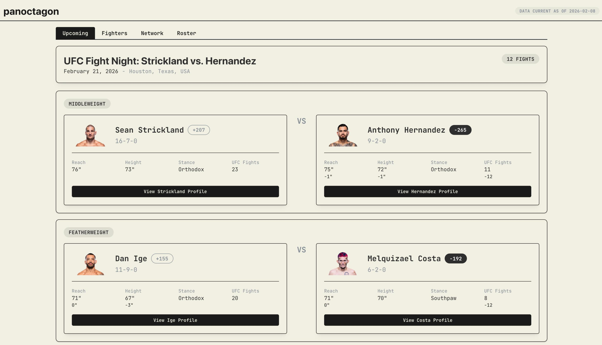
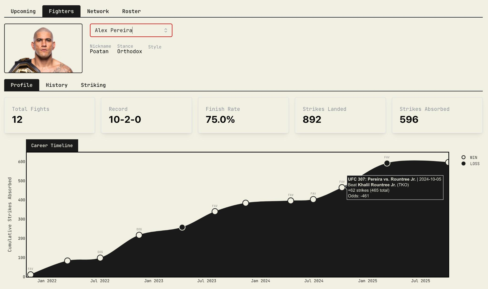
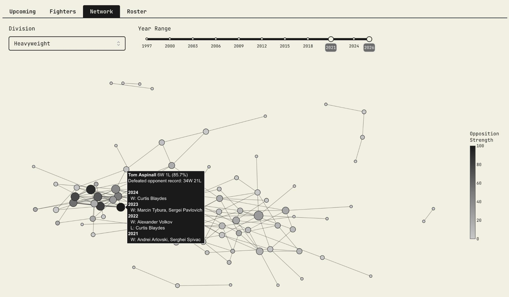
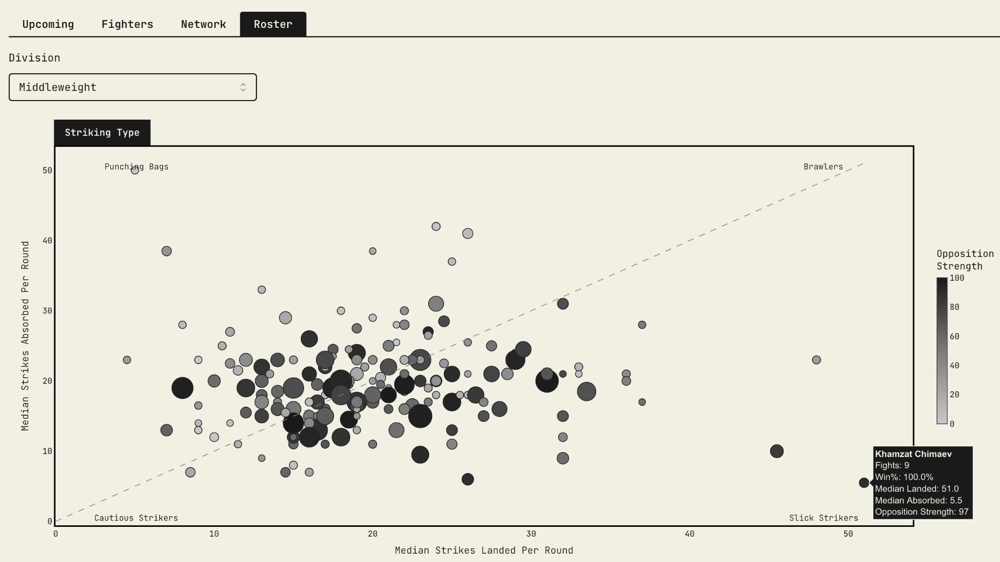

# panoctagon

UFC fight data aggregation, analysis, and visualization

Live at [panoctagon.jeffbrennan.dev](https://panoctagon.jeffbrennan.dev)

## Site

The dashboard has four main views:

### Upcoming
Shows upcoming UFC events with fighter matchup comparisons, physical stats, records, and betting odds.

 

### Fighters
Individual fighter profiles with career stats, fight history, and performance breakdowns.

 

### Network
Visual graph of fighter matchup connections.

 

### Roster
Searchable roster with division filtering and stat comparisons.

 

## API

Available at `/api`. Full docs at `/api/docs`.

| Endpoint | Description |
| --- | --- |
| `GET /fighter` | Search fighters by name or division |
| `GET /fighter/{id}` | Fighter bio, record, and recent fights |
| `GET /fighter/{id}/stats` | Fighter statistics |
| `GET /fighter/{id}/fights` | Fight history |
| `GET /events` | List events |
| `GET /event/{id}` | Event details and fight card |
| `GET /fight/{id}` | Fight details with round-by-round stats |
| `GET /rankings` | Leaderboard by division |
| `GET /roster` | UFC roster with filters |
| `GET /upcoming` | Upcoming events and matchups |
| `GET /divisions` | All divisions |

## CLI

The `panoctagon` CLI provides terminal access to the same data.

```
panoctagon upcoming
panoctagon fighter "Max Holloway"
panoctagon compare "Max Holloway" "Ilia Topuria"
panoctagon leaderboard
panoctagon event
panoctagon roster
```

## Stack

Python, FastAPI, Dash, DuckDB, Dagster, dbt

## Sources

- [ufcstats.com](http://ufcstats.com) - fight stats and decisions
- [bestfightodds.com](https://www.bestfightodds.com) - betting odds
